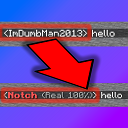

  

  
  
<h1>NameProtect</h1>
<h3>Now you can change your nickname in ONLY your chat (for screenshots) in Minecraft 1.19+</h3>  

# Dependencies
You need: [Fabric API](https://modrinth.com/mod/fabric-api), [oωo lib](https://modrinth.com/mod/owo-lib), [Mod Menu](https://modrinth.com/mod/modmenu)

